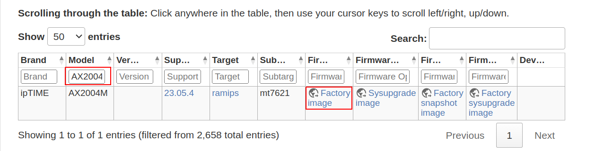
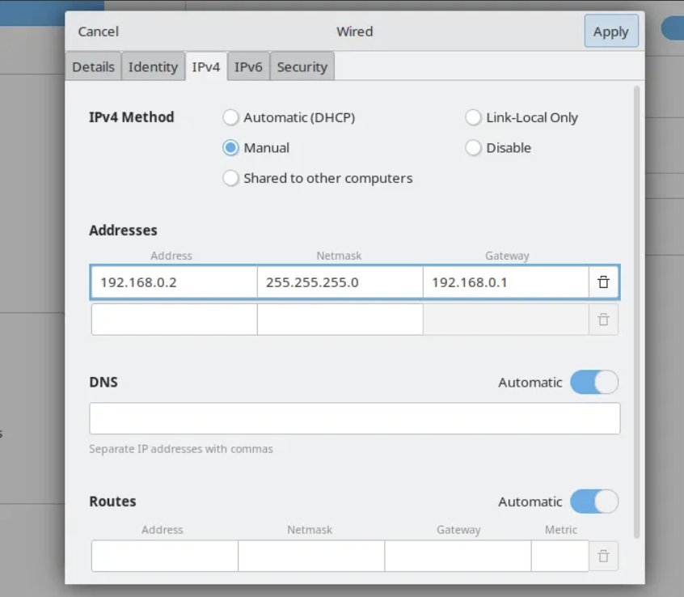
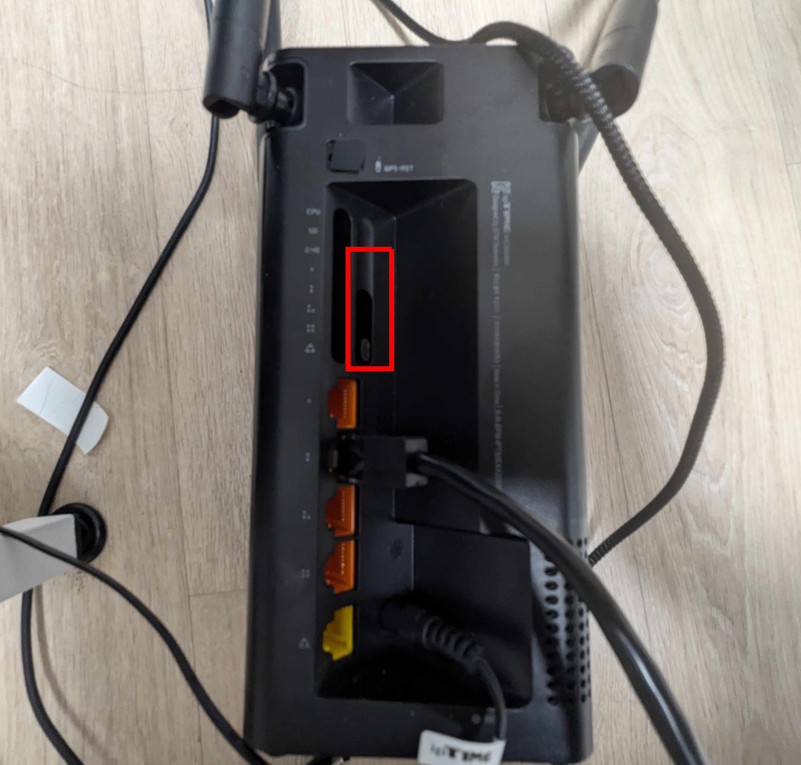
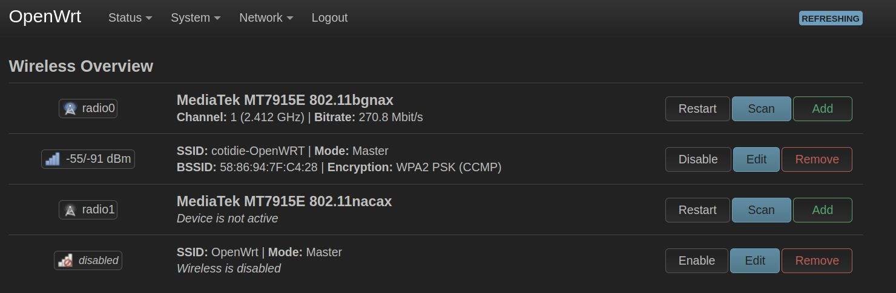

# OpenWRT 설치과정
## 개요
OpenWRT는 설치 과정에 대한 자료가 부족하고, 기종이 다양하기에 설치에 시행착오가 필요하다. 이 문서에서는 ipTIME AX2004M 기종을 바탕으로 펌웨어 다운로드부터 펌웨어를 선택하는 기준, 그리고 SSH 접근을 위한 설정 등 설치 전반에 대한 항목을 설명한다.

## 1. 펌웨어 선택 및 다운로드
- **기종**: ipTIME AX2004M
- **아키텍처**: [ramips](https://openwrt.org/docs/techref/targets/ramips)
  - Ralink 사의 MIPS 아키텍처를 이르는 용어
  - MIPS란 RISC의 일종으로 파이프라인 및 interlock을 고려하지 않은 경량 아키텍처이다.
- **CPU 기종**: mt7621

펌웨어 파일은 다음 두 소스에서 다운받을 수 있다.

1) **최신 버전 테이블**
  
| **Link**: [기종 테이블](https://openwrt.org/toh/views/toh_fwdownload)  
- 위 그림과 같이 공유기 기종을 검색한다.
- Factory Image를 다운로드 받는다. (LuCI 및 기타 툴이 함께 설치)

2) **Releases 아카이브**  
| **Link**: [아카이브](https://downloads.openwrt.org/releases/)  
: 아키텍처 > CPU > 기종 순으로 폴더에 접근하여 원하는 버전을 다운로드 받는다. AX2004M의 경우 Recovery 모드에 진입하여 펌웨어를 설치할 것이므로 `~recovery.bin` 파일을 다운받아야 한다.

## 2. 공유기 리셋 및 펌웨어 업데이트
1. **노트북의 네트워크 인터페이스 카드의 IP 고정**
  
공유기와 노트북을 이더넷 케이블로 유선 연결한 후 NIC의 IPv4 설정을 다음과 같이 변경합니다.
- IPv4 부여 방식: Manual (수동)
- **Address**: 192.168.0.2
  - Gateway와 같은 대역 (192.168.0.x)로 설정
- **Netmask**: 255.255.255.0
- **Gateway**: 192.168.0.1
  - Gateway 주소로 Recovery Mode에 진입

2. **공유기 Recovery Mode에 진입 및 펌웨어 업데이트**
  
  - 전원 케이블을 빼고, RESET 버튼(빨간 테두리)를 누른 채 다시 꼽는다.
  - 약 10초 정도, CPU의 불이 깜빡임을 멈출 때까지 버튼을 누르고 있는다.
  - 약 30초 정도 부팅을 기다린 후, `192.168.0.1` 주소로 접속한다.
  - 다운로드 받은 펌웨어를 업로드하고 재부팅을 기다린다.

3. **LuCI 진입/SSH 접근**
   - 펌웨어 업데이트 약 5분 후 Wired 연결 설정의 Address를 `192.168.1.2`로 변경한다. (192.168.1.x)
   - `192.168.1.1`로 LuCI 웹 인터페이스에 접속한다.
   - 만약 LuCI가 설치되지 않았다면 위 `192.168.1.1` 주소에 SSH로 접근한다.
 
4. **Wifi 활성화**
  
LuCI 인터페이스의 [Network] > [Wireless] 메뉴에서 `radio0`를 활성화하고, 와이파이 하나를 Enable한다.
  - radio0, radio1은 2.4Ghz와 5Ghz 같은 무선 채널을 의미한다.
  - SSID는 해당 무선 채널에 설정할 와이파이를 의미한다.
와이파이 Enable 이후 공유기에 무선으로 접속이 가능하다.
